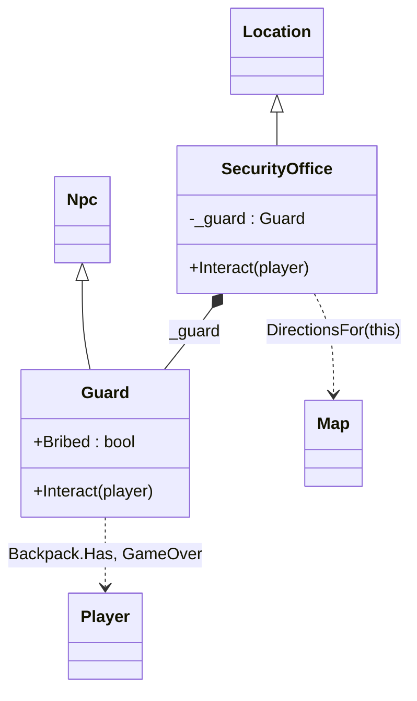

# Komposition, arv och ansvar i Emporia Amnesia

Ni har byggt i två dagar. Nu är det dags att titta på *hur* koden hänger ihop – inte för att ändra den, utan för att kunna förklara den. Det är det inlämningsuppgiften och projektet kommer att kräva: "motivera dina designval". Ha klassdiagrammet över hela motorn bredvid er när ni läser.

## 1. Två sätt att återanvända: arv och komposition

Det finns två sätt att låta en klass använda en annan. **Arv** betyder "är en sorts": `Guard : Npc` – en vakt *är* en npc, och får med sig allt `Npc` har. **Komposition** betyder "har en": `SecurityOffice` har ett fält `_guard` av typen `Guard` – rummet *har* en vakt.

```csharp
class Guard : Npc                     // inheritance: Guard IS an Npc
{
  public bool Bribed = false;
  public override void Interact(Player player) { ... }
}

class SecurityOffice : Location       // inheritance: SecurityOffice IS a Location
{
  private Guard _guard = new();       // composition: SecurityOffice HAS a Guard

  public override void Interact(Player player)
  {
    _guard.Interact(player);          // and delegates to it
  }
}
```

Båda finns i samma tre rader, och de svarar på olika frågor. Arvet svarar på "vad *är* den här klassen, vad lovar den att kunna?" – en `Location` kan `Interact`, det vet `Game`. Kompositionen svarar på "vad *består* den av?" – ett vaktkontor består bland annat av en vakt.

**Tumregeln:** välj komposition först. Arv är rätt när basklassens *beteende* är exakt det ni vill ha och bara vill ändra en del av – `Location` har `Interact` som `Game` anropar, och ni byter ut innehållet. Arv är fel när det bara är bekvämt: `class Guard : SecurityOffice` hade gett vakten alla rummets fält gratis, men en vakt är inte ett rum, och koden hade blivit obegriplig. Ett tecken på fel arv är att subklassen inte använder det mesta den ärver.

En tredje sak i samma bild: `Location` och `Npc` ärver **inte** från varandra, men båda implementerar `IInteractable`. Det är varken arv eller komposition – det är ett gemensamt löfte. De delar inte kod, bara en metodsignatur.

## 2. Separation av ansvar – vem vet vad?

Varje klass i motorn vet *en* sak. Det är inte en slump, det är designen:

| Klass | Ansvar | Vet **inte** |
|---|---|---|
| `Game` | Loopen och huvudmenyn. Frågar kartan var spelaren är, visar platsen, anropar `Interact`. | Vad som finns på någon plats. |
| `Map` | Var platserna ligger, vilka grannar en ruta har. | Vad man kan göra på en plats. |
| `Player` | Var spelaren står, vad hen bär, om spelet är slut. | Var hen *kan* gå – det frågar `Game` kartan om. |
| `Backpack` | Vilka föremål spelaren har. `Add`, `Has`, `Remove`. | Vad föremålen används till. |
| `Location` (basklass) | Namn, beskrivning, utgångar, lösa föremål. Standard-`Interact` som inte gör något. | Vilket rum det är – det vet subklassen. |
| Er `Location`-subklass | Vad som händer *här*: pusslet, dörren, vilken npc som finns. | Vad som händer i andra rum. |
| `Npc` + er subklass | Vad personen säger och minns. | Vilket rum hen står i. |
| `Menu` | Visa en numrerad lista och läsa ett giltigt svar. | Vad alternativen betyder. |

Testet ni kan göra på er egen kod: **"är jag på väg att skriva något i klass X som handlar om Y?"** Skriver ni en `if` i `Game` som kollar om spelaren är i kemtvätten – stopp, det hör hemma i `DryCleaner.Interact`. Lägger vakten till ett föremål i ryggsäcken – bra, det är vaktens sak. Ändrar vakten `Directions` på rummet – nej, det är rummets sak, vakten sätter `Bribed` och rummet läser det. Det är exakt så `SecurityOffice` gör.

Vinsten är den ni redan upplevt: sju grupper skriver i samma spel utan att röra varandras filer. Det är vad "separation av ansvar" betyder i praktiken.

## 3. Läsa befintlig kod – en metod

I projektet om tre veckor, och i varje jobb ni någonsin får, kommer ni att läsa mer kod än ni skriver. Det finns en teknik:

1. **Börja där programmet börjar.** `Program.cs`: `new Game().Start()`. Allt hänger under den raden.
2. **Hitta loopen.** `Start()` har `while (isRunning)`. Vad händer ett varv? `PlayTurn()`. Det är spelets hjärta – läs den metoden ordentligt.
3. **Följ ett menyval hela vägen.** Välj *Interagera*: `case 4` → `Interact()` → `CurrentLocation().Interact(player)`. Här stannar spåret – vilken `Interact` som körs beror på vilket rum spelaren står i. Det är **polymorfism**: variabeln har typen `Location`, men objektets *riktiga* klass bestämmer.
4. **Skjut upp detaljerna.** `Map.DirectionsFor`, `Menu.Ask`, `Backpack.Remove` – läs *vad de heter och vad de returnerar*, inte hur de fungerar. Namnet räcker för att förstå flödet. Gå in i dem först när ni behöver.
5. **Ställ frågor till koden.** "Var ändras `player.Row`?" (två ställen: `TryMovePlayer` och `Teleport`). "Vem sätter `GameOver`?" (bara era `Interact`-metoder). Sök i hela projektet – att veta *var ett fält ändras* är ofta hela förståelsen.

Den som kan berätta "ett varv i loopen gör så här, och Interagera hamnar i rummets klass" har förstått motorn. Resten är detaljer.

## 4. Från diagram till kod – och tillbaka

Ett klassdiagram är kod utan kroppar: varje klass en låda med fält och metoder, och pilar för hur klasserna hänger ihop. Ni ska rita ett över **ert kluster** – på papper, innan er handledning.

Så här ser grupp 4:s ut som exempel (i Mermaid-syntax, men rita för hand):



Det som ska med: era klasser, vilka basklasser de ärver från (ihålig pil), vilka objekt de *äger* (fylld romb), vilka andra klasser de *anropar* (streckad pil), och fälten som är ert minne (`attempts`, `Bribed`). Det som inte ska med: `Game`, `Map`, `Menu` som lådor – de räcker som mål för pilarna.

Under handledningen lägger vi diagrammet bredvid koden. Stämmer det? Ofta upptäcker man att ett fält saknas i diagrammet, eller att en pil i diagrammet inte finns i koden – och båda är värdefulla att hitta.

## 5. Repetition inför inlämningsuppgiften

Begreppen ni ska kunna förklara, med var de finns i spelet:

| Begrepp | En mening | I spelet |
|---|---|---|
| Klass / objekt | Ritning / sak byggd efter ritningen | `Guard` / `new Guard()` i `SecurityOffice` |
| Konstruktor | Metod som körs vid `new`, sätter startvärden | `public Guard() { Name = "Vakten"; }` |
| Fält / property | Objektets minne / kontrollerad åtkomst till det | `private int attempts` / `public string Name { get; protected set; }` |
| Inkapsling | Privat data, publika metoder som är enda vägen in | `Backpack.Items` ändras via `Add`/`Remove`, inte direkt |
| Arv | "är en sorts", ärver fält och metoder | `Guard : Npc` |
| `virtual` / `override` / `base` | Basklassen tillåter byte, subklassen byter, `base.` anropar originalet | `Location.Interact` / `OutsideDryCleaner.Interact` |
| Polymorfism | Variabelns typ är basklassen, objektets klass bestämmer vilken metod som körs | `CurrentLocation().Interact(player)` |
| Interface | Ett löfte om metoder, ingen kod | `IInteractable` |
| Komposition | "har en" | `SecurityOffice` har `_guard` |
| `static` | Tillhör klassen, inte objektet | `Map.Locations`, `Directions.Label()` |
| Enum | Typ med fasta namngivna värden | `Direction` |
| `ToString()` | Hur objektet blir text | `Item.ToString()` |

Kan ni peka på varje rad i er egen kod och säga vilket begrepp det är, är ni redo för inlämningsuppgiften.
